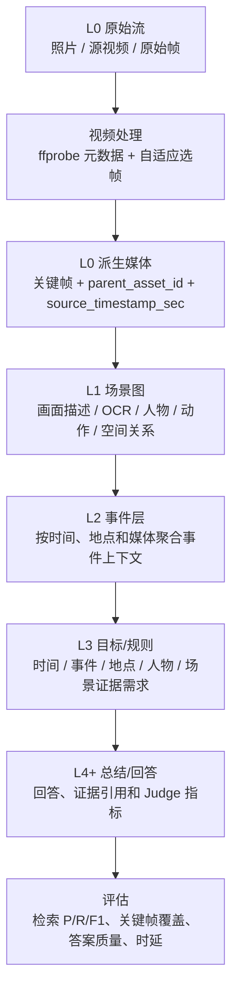

# 关键帧优化、视频处理与记忆层级证据链评估

更新时间：2026-09-04  
评测 run：`20260902-154953-album3-max-video10-qwen3-vl-4b-reuse-476c69`  
数据范围：`album_57a2127986d2`，全量 487 道 QA、344 个原始媒体、10 个源视频。

## 结论先看

本次全量 run 页面显示的媒体召回率为 **40.7%（micro）**，距离阶段目标 **50%** 还差 **9.3 个百分点**；按题目等权宏平均计算为 **51.8%（macro）**。上周记录的 **26%** 是历史正确率基线，不与媒体召回率直接横比。本次 full run 的 exact accuracy 另为 **20.0%**、core accuracy 为 **38.5%**，用于衡量最终回答质量；9 月 1 日 10/10 小样本复用 run 的媒体召回率 **55.6%** 也不能与 487 题全量结果直接比较。本次已经把关键帧从“只看数量”推进到“压缩率、父视频召回、候选精确率、最终精确率、时间覆盖、处理速度、回答对照”七类指标，并在页面显示每层证据。

视频处理速度的硬目标调整为 **≥ 2× 原视频时长**。本批原始视频总时长为 86.42 秒，因此完整的视频处理（包含关键帧视觉解析和事件记忆构建）必须控制在 **43.21 秒以内**。旧实现 686.219 秒明显不达标；优化后的配置已部署，需用同一数据集重新跑完整流水线确认最终实测值。

关键帧工程侧的当前结果是：10 个源视频共约 2074 个原始视频帧，保留 33 个关键帧，保留率 **1.6%**、帧压缩率 **98.4%**；GT 源视频父级召回 **70.7%（87/123）**，候选关键帧精确率 **29.0%（254/875）**，模型最终返回关键帧精确率 **61.0%（153/251）**，平均采样间隔 **2.4 秒**，平均覆盖跨度 **5.5 秒**。视频处理累计耗时 **686.2 秒**、平均 **68.6 秒/视频**，以原始视频总时长 86.42 秒计，吞吐约 **0.126× 实时**（每 1 秒视频平均需要约 7.94 秒处理时间）。

## 1. 全量指标对照

| 指标 | 当前全量值 | 计算口径 | 说明 |
|---|---:|---|---|
| 上周历史正确率基线 | 26.0% | 历史质量记录 | 与媒体召回率、当前 exact 均不是同一指标 |
| 媒体检索召回率（micro） | 40.7% | 全量 run 页面列表口径 | 当前全量结果，距离 50% 目标差 9.3 个百分点 |
| 媒体检索召回率（macro） | 51.8% | 逐题等权宏平均 | 另一聚合口径，不替代页面的 micro 值 |
| 最终 exact accuracy | 20.0% | 当前 run 的 QA 汇总 | 最终回答质量指标，独立于媒体召回率 |
| Core accuracy | 38.5% | 当前 run 的核心事实正确率 | 比 exact 更宽松，不能替代 exact |
| 总媒体检索 P/R/F1（micro） | 9.3% / 40.7% / 15.1% | 全量媒体相关数与返回数汇总 | 页面媒体召回率采用此 micro 口径，候选噪声明显 |
| 总媒体检索 P/R/F1（macro） | 10.6% / 51.8% / 14.1% | 逐题等权宏平均 | 召回较高但精确率低，说明候选噪声明显 |
| 图片检索 P/R/F1 | 12.4% / 54.8% / 16.2% | 图片媒体按稳定媒体标识匹配 | 目前图片候选仍有较多无关项 |
| 关键帧保留率 | 33/2074 = 1.6% | 关键帧数 ÷ 原始视频帧数 | 减少后续视觉调用量 |
| 关键帧压缩率 | 98.4% | 1 − 关键帧数 ÷ 原始视频帧数 | 压缩很激进，必须结合召回率判断是否过压缩 |
| 源视频父级召回 | 70.7%（87/123） | 被任一关键帧覆盖的 GT 源视频目标 ÷ GT 源视频目标 | 关键帧能否代表原视频 |
| 候选关键帧精确率 | 29.0%（254/875） | 相关候选帧 ÷ 候选帧总数 | 检索候选池的噪声水平 |
| 最终返回关键帧精确率 | 61.0%（153/251） | 相关最终帧 ÷ 最终返回帧 | 重排和工具调用之后真正使用的有效帧比例 |
| 平均采样间隔 | 2.4 秒 | 同一视频相邻关键帧时间戳差的均值 | 采样密度，不是答案准确率 |
| 平均覆盖跨度 | 5.5 秒 | 同一视频最晚时间戳 − 最早时间戳的均值 | 单个视频被关键帧覆盖的时间范围 |
| 视频处理速度 | 0.126× 实时 | 原始视频总时长 ÷ 处理耗时总和 | 低于 1× 表示慢于实时；受当前串行流水线和视觉模型耗时影响 |
| 视频处理耗时 | 686.2 秒 / 68.6 秒 | 10 个视频的后端 `video_processing_seconds` | 这是后端处理耗时，不等同于并发任务的用户等待时间 |

### 与上周 26% 的正确率如何解释

“26%”是历史正确率，“40.7%”是当前全量媒体召回率 micro，“20.0%”是当前 exact accuracy，三者不是同一指标。当前媒体召回率相对 50% 目标还差 9.3 个百分点；exact accuracy 仍需在相同题集、模型和 Judge 口径下与 26% 做严格复核。关键帧压缩和检索链路虽然已经可量化，但还没有证明能提升最终回答质量；尤其当前“有关键帧候选”题的 Judge 均分为 0.5673，“无关键帧候选”题为 0.6066，差值 **-0.0393/2**，只能作为关联信号，不能直接下因果结论。

## 2. 关键帧和记忆层级如何实现



实现要点：

1. **选帧**：流水线根据 `visual_information_gain`、`maximum_time_gap`、`first_valid_frame` 记录选帧原因；不把关键帧直接当成事件。
2. **可追溯**：每个关键帧保存 `parent_asset_id` 和 `source_timestamp_sec`，因此可以把“返回关键帧”归因回源视频和时间位置。
3. **场景解析**：关键帧进入 L1，产生视觉观察、OCR、人物和动作信息；这些观察应带媒体 ID、时间戳和来源。
4. **事件聚合**：L2 用多个媒体的观察、时间、地点和实体形成事件上下文；当前 run 的 QA 工具轨迹带回了 149 个事件上下文。
5. **问题分解**：L3 将问题拆成时间、事件、地点、人物、场景等证据需求，再用证据账本记录满足状态。
6. **检索和回答**：候选检索先保留较大的召回池，再按问题槽位、父视频关系、时间和证据支持进行重排；最终回答阶段使用 L4+ 摘要和逐题证据。

### 速度优化实现

旧链路的主要问题是 vLLM 启动参数 `max-num-seqs=1`，导致 33 个关键帧视觉请求实际串行；事件摘要也在视频线程中逐个调用。当前 100 服务器改为：

```text
vLLM: --max-num-seqs 8
关键帧 VLM: SENTRIX_VIDEO_KEYFRAME_WORKERS=8
事件摘要 VLM: SENTRIX_VIDEO_EVENT_SUMMARY_WORKERS=8
FlashInfer: VLLM_USE_FLASHINFER_SAMPLER=0（避免本机缺少 nvcc 时触发 JIT 失败）
```

关键帧任务仍写入完整观察、向量、人物和事件关系；只是利用 vLLM batch 并发。事件摘要使用独立 SQLite 连接并发写回，避免共享游标。压测中，4 个真实视觉请求从旧配置的约 27.65 秒降至 8.42 秒，说明瓶颈确实是服务端串行排队，而不是视频抽帧本身。最终是否达到 2×，以完整 run 的 `video_processing_seconds_total <= 43.21s` 为准。

## 3. 指标如何判读

### 关键帧指标

- **保留率 / 压缩率**：回答“减少了多少帧”。压缩率高只能说明计算量下降，若父视频召回下降，说明压缩过度。
- **父视频召回**：回答“GT 需要的视频是否至少有一个代表帧”。这是关键帧覆盖能力的第一道指标。
- **候选精确率**：回答“候选池里有多少是相关的”。29.0% 表示候选池仍混入较多无关帧，应该优先优化检索过滤和重排。
- **最终精确率**：回答“最后交给模型的帧有多少有效”。61.0% 高于候选精确率，说明重排已有过滤作用，但仍有提升空间。
- **间隔 / 跨度**：回答“帧分布得密不密、覆盖时间长不长”。应与场景切换、运动强度和问题时间粒度联合调参。
- **回答质量差值**：回答“带关键帧候选的题是否更容易答对”。当前差值为负，下一步应做同题配对 replay，排除题型分布造成的偏差。

### 质量和检索指标

- **Precision（精确率）** = 返回的相关媒体数 ÷ 返回媒体总数：越高表示噪声越少。
- **Recall（召回率）** = 返回的相关媒体数 ÷ GT 相关媒体总数：越高表示漏检越少。
- **F1** = 2 × Precision × Recall ÷ (Precision + Recall)：同时考虑精确率和召回率。
- **Exact accuracy**：答案与评分标准严格一致的比例；适合衡量最终任务完成度。
- **Core accuracy**：按核心事实或关键槽位判断的正确率；用于定位“答案部分正确但不完全一致”的情况。
- **处理速度**：用原始视频时长除以处理耗时；要同时报告总耗时、每视频均值和是否并发，避免把串行/并行结果混为一谈。

## 4. 页面改进内容

页面“记忆层级与关键帧证据链”现在每层都展示具体证据：

| 层级 | 页面新增证据 |
|---|---|
| L0 原始流 | 源视频数、关键帧数、父媒体关联和时间戳是否存在 |
| L1 场景图 | `inspect_photo` 成功率、视觉调用数、OCR 调用数、观测场景数 |
| L2 事件层 | 全量 QA 轨迹的事件上下文数，以及当前展开题的事件数 |
| L3 目标/规则 | 满足/总证据需求、规划决策数 |
| L4+ 总结/回答 | Judge 均分、exact accuracy、QA 完成进度 |

关键帧面板新增全量帧压缩、视频处理速度，并增加“指标定义、计算式与判读”展开区。这样页面上的每一个百分比或秒数都能回答三个问题：分子分母是什么、反映哪一层、数值变差时应查哪一段链路。

## 5. 下周建议

1. 将每个视频的采样预算改为按场景切换、运动强度和问题时间粒度自适应，避免所有视频固定压成同样密度。
2. 对候选关键帧增加父视频、时间窗口和地点/事件槽位联合重排，优先把候选精确率从 29.0% 提升。
3. 对关键帧与非关键帧做同题 paired replay，报告相同问题的质量差，而不是只比较两组总体均值。
4. 在 L1/L2 页面继续展示“观察 → 事件 → 目标”的证据 ID 链，逐题定位是解析、存储、检索还是工具调用造成漏检。
5. 重新跑同一题集、同一模型、同一 Judge 提示词，并固定 micro/macro 统计口径，才能严格回答“26% 到多少”的质量变化；当前页面的可比阶段目标是媒体召回率 **40.7% → 50%**。
